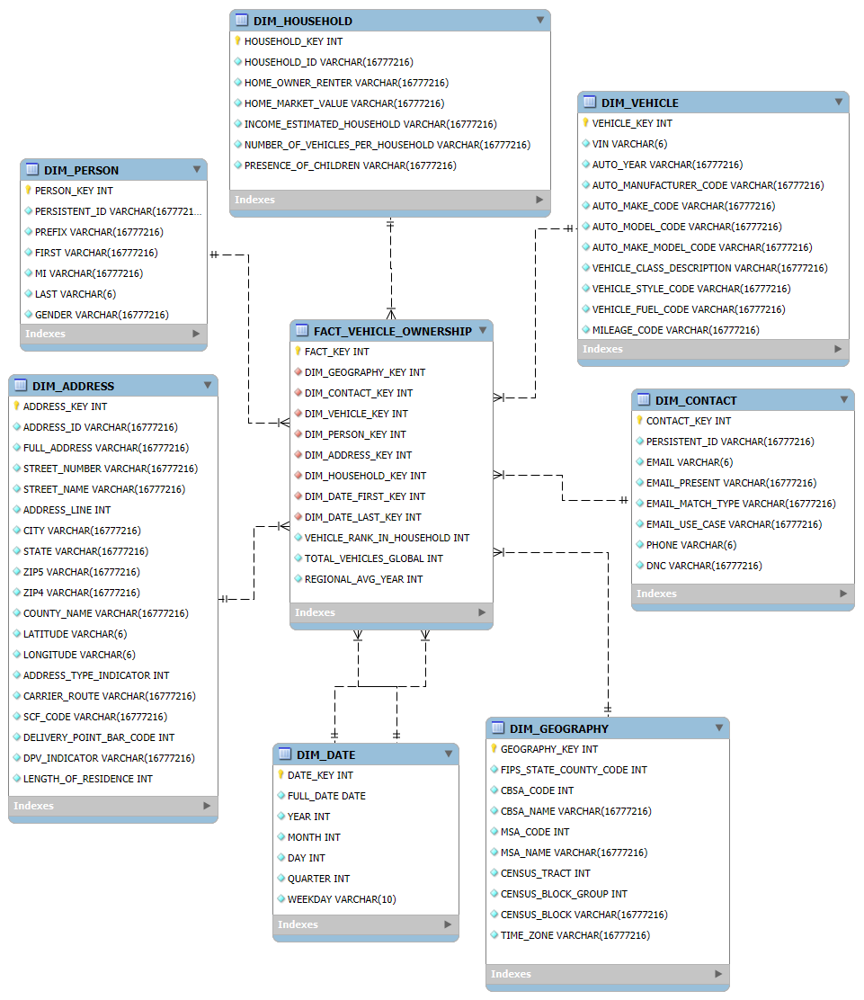
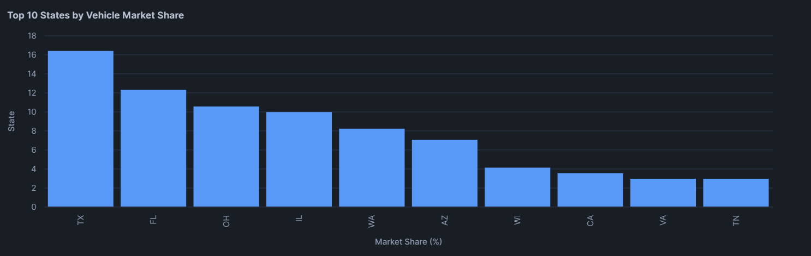
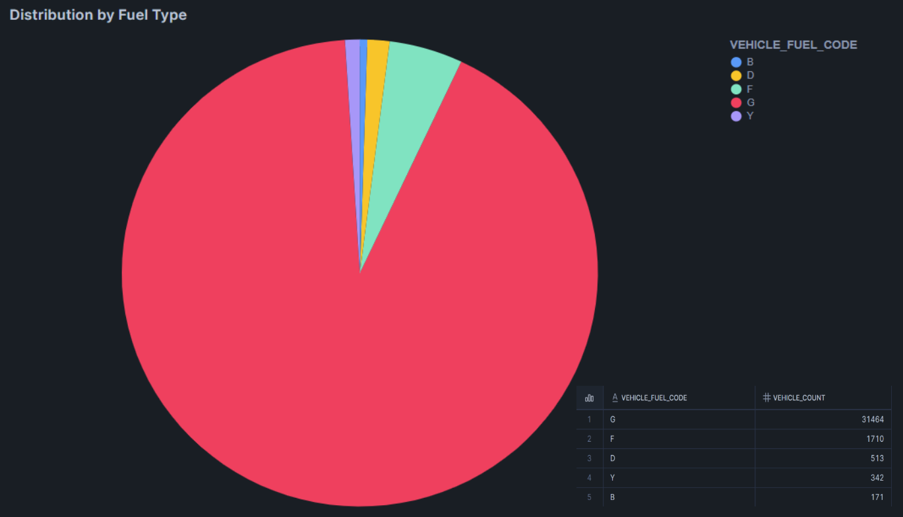
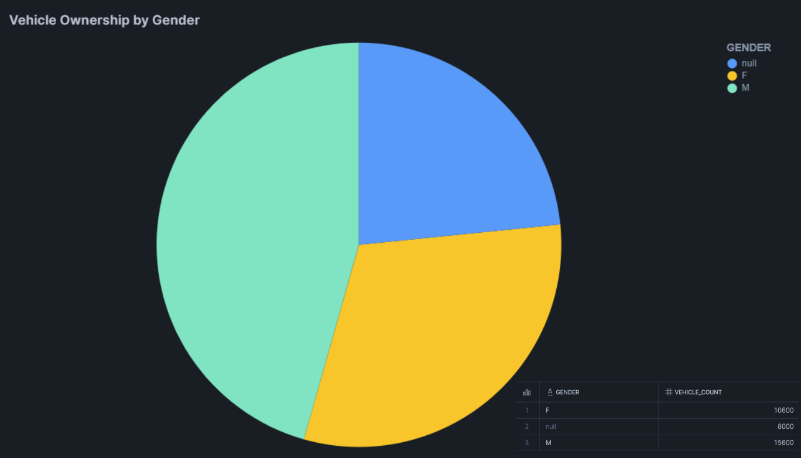
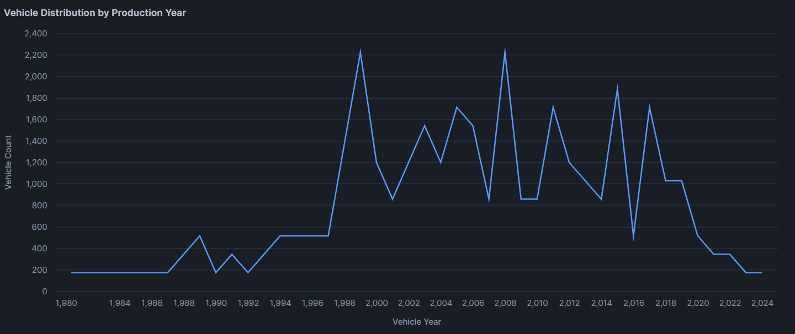
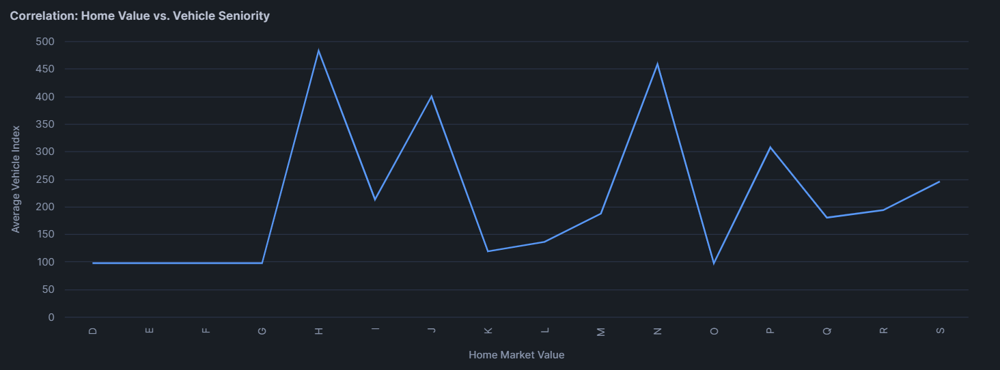

<div align="center">
    <p>
        <h1> dt-alesco-auto-database </h1>
        DT - FINAL PROJECT
    </p>
    <a href="https://github.com/theAntarux/dt-alesco-auto-database/actions">
        
    </a>
    <br/>
    <br/>
</div>

## O Projekte
Tento repozitár predstavuje úkážkovú implementáciu ELT procesu v [**Snowflake**](https://www.snowflake.com/en) pre Star schému. 
Projekt pracuje s datasetom [**Alesco Auto Database**](https://app.snowflake.com/marketplace/listing/GZ1M6ZQEKHL), najväčšou a najpresnejšou automobilovou databázov s 
viac ako 238 miliónmi záznamov o vozidlách (vrátane vlastníctva, pravidelne aktualizovaných z proprietárnych transakcií).
Projekt sa zameriava na analýzu vlastníctva vozidiel, preferencií spotrebiteľov a demografických údajov súvisiacich s automobilmi.


Cieľom ukážky je *demonštrovať*, ako má vyzerať dokumentácia, implementácia a vizualizácie pre záverečný projekt.

## Obsah
1. [Úvod a popis zdrojových dát](https://github.com/theAntarux/dt-alesco-auto-database?tab=readme-ov-file#1-%C3%BAvod-a-popis-zdrojov%C3%BDch-d%C3%A1t)
2. [Návrh dimenzionálneho modelu](https://github.com/theAntarux/dt-alesco-auto-database?tab=readme-ov-file#2-n%C3%A1vrh-dimenzion%C3%A1lneho-modelu)
3. [ELT proces v Snowflake](https://github.com/theAntarux/dt-alesco-auto-database?tab=readme-ov-file#3-elt-proces-v-snowflake)
4. [Vizualizácia dát](https://github.com/theAntarux/dt-alesco-auto-database?tab=readme-ov-file#4-vizualiz%C3%A1cia-d%C3%A1t)

## 1. Úvod a popis zdrojových dát
Projekt analyzuje dáta o vozidlách, spotrebiteľov a geografických údajov:
- *vlastníctva vozidiel*
- *preferencií spotrebiteľov*
- *demografických údajov súvisiacich s automobilmi*

Dáta pochádzajú z [Snowflake Marketplace](https://www.snowflake.com/en/product/features/marketplace) datasetu [**Alesco Auto Database**](https://app.snowflake.com/marketplace/listing/GZ1M6ZQEKHL).
<br/>

## 1.1 Dátová Architektúra

### ERD Model
Dáta z datasetu sú usporiadané v relačnom modeli, ktorého štruktúra je znázornená na entitno-relačnom-diagrame. 

Model obsahuje jednu primárnu tabuľku:
- *AUTO_DATA_SAMPLE_VIEW*

<br/>

<div align="center">
    
    <br>
    <em>Obrázok 1: Entitno-relačná schéma</em>
</div>
<br/>

## 2. Návrh dimenzionálneho modelu
Na základe [Kimballovej metodológie modelovania](https://en.wikipedia.org/wiki/Kimball_lifecycle) bola pre tento projekt navrhnutá 
schéma typu [Star](https://en.wikipedia.org/wiki/Star_schema).

Štruktúra navrhnutého hviezdicového modelu je znázornená na nasledujúcom obrázku:

<div align="center">
    
    <br>
    <em>Obrázok 2: Star schéma</em>
</div>
<br/>

Centrálna faktová tabuľka **fact_vehicle_ownership** obsahuje merateľné fakty o vlastníctve vozidiel (napr. *dátum registrácie*, *počet vozidiel*, *...*) a je prepojená s viacerými denormalizovanými dimenziami prostredníctvom kľúčov. Tento prístup zabezpečuje vysokú výkonnosť dotazov a jednoduchú rozšíriteľnosť modelu.

Tabuľka faktov obsahuje nasledujúcich 7 dimenzií schémy:
- **dim_vehicle**: Informácie o vozidle (VIN, rok výroby, výrobca, značka, model, trieda, typ paliva a odhadovaný nájazd).
- **dim_contact**: Kontaktné údaje (persistent ID, e-mail, telefón, typy e-mailov a DNC status).
- **dim_geography**: Geografický kontext (FIPS kódy, CBSA/MSA, census tract/block a časové pásmo).
- **dim_date**: Hierarchia dátumu (rok, štvrťrok, mesiac, deň). Použitá pre dátum prvej a poslednej registrácie.
- **dim_address**: Detailná adresa (ulica, mesto, štát, PSČ, súradnice, dĺžka bývania a doručovacie kódy).
- **dim_person**: Osobné údaje vlastníka (meno, priezvisko, titul, pohlavie a persistent ID).
- **dim_household**: Informácie o domácnosti (odhadovaný príjem, hodnota domu, vlastníctvo/podnájom, počet vozidiel a prítomnosť detí).

<br/>

## 3. ELT proces v Snowflake
Lorem ipsum dolor sit amet consectetur adipiscing elit. Quisque faucibus ex sapien vitae pellentesque sem placerat. In id cursus mi pretium tellus duis convallis. Tempus leo eu aenean sed diam urna tempor. Pulvinar vivamus fringilla lacus nec metus bibendum egestas. Iaculis massa nisl malesuada lacinia integer nunc posuere. Ut hendrerit semper vel class aptent taciti sociosqu. Ad litora torquent per conubia nostra inceptos himenaeos.

<br/>

## 4. Vizualizácia dát
V tejto časti prezentujeme 6 vizualizácií, ktoré využívajú výpočtové metriky z faktovej tabuľky fact_vehicle_ownership na poskytnutie doležitých informácií.

### Vizualizácia 1: TOP 10 štátov podľa počtu vozidiel

```sql
SELECT 
    a.STATE,
    COUNT(*) AS VEHICLE_COUNT,
    ROUND((COUNT(*) / MAX(f.TOTAL_VEHICLES_GLOBAL)) * 100, 2) AS MARKET_SHARE_PCT
FROM fact_vehicle_ownership f
JOIN dim_address a ON f.DIM_ADDRESS_KEY = a.ADDRESS_KEY
GROUP BY a.STATE 
ORDER BY VEHICLE_COUNT DESC LIMIT 10;
```
#### Ktoré štáty maju najväčŚie zastúpenie v databáze a aký je ich percentuálny podiel?
Graf ukazuje dominanciu štátu Texas (TX) s trhovým podielom cez 16%, nasledne je Flodida (FL) s 12%. Tieto informácie umožňujú efektívne rozdelenie regionálneho marketingu do lokalít s najvyššou hustotou vozidiel.

<div align="center">
    
    <br>
    <em>Obrázok 3: Vizualizácia 1</em>
</div>
<br/>

### Vizualizácia 2: TOP 5 výrobcov

```sql
SELECT 
    v.AUTO_MANUFACTURER_CODE,
    COUNT(*) AS VEHICLE_COUNT
FROM fact_vehicle_ownership f
JOIN dim_vehicle v ON f.DIM_VEHICLE_KEY = v.VEHICLE_KEY
GROUP BY v.AUTO_MANUFACTURER_CODE LIMIT 5;
```

#### Ktoré značky výrobcov sú najrozšírenejšie?
Najúspešnejším výrobcom je kód "L" s takmer 12 000 vozidlami. Tento prehľad pomáha pri hladaní značky, ktorá je najrozšírenejšia.

<div align="center">
    
    <br>
    <em>Obrázok 4: Vizualizácia 2</em>
</div>
<br/>

### Vizualizácia 3: Distribúcia typu paliva

```sql
SELECT 
    v.AUTO_MANUFACTURER_CODE,
    COUNT(*) AS VEHICLE_COUNT
FROM fact_vehicle_ownership f
JOIN dim_vehicle v ON f.DIM_VEHICLE_KEY = v.VEHICLE_KEY
GROUP BY v.AUTO_MANUFACTURER_CODE LIMIT 5;
```

#### Ktorá pohonná hmota je najrozšírenejšia?
Drvivá väčšina využíva benzín (kód "G"), čo predstavuje takmer celú plochu koláčového grafu. Naznačuje nízku adopciu elektromobility.

<div align="center">
    
    <br>
    <em>Obrázok 5: Vizualizácia 3</em>
</div>
<br/>

### Vizualizácia 4: vlastníctvo vozidiel podľa pohlavia

```sql
SELECT 
    p.GENDER,
    COUNT(*) AS VEHICLE_COUNT
FROM fact_vehicle_ownership f 
JOIN dim_person p ON f.DIM_PERSON_KEY = p.PERSON_KEY
GROUP BY p.GENDER;
```

#### Existujú rozdiely vo vlastníctve vozidiel medzi mužmi a ženami?
Muži (M) vlastnia približne o 50% viac vozidiel ako ženy (F). Výraznú časť tvoria aj neznáme hodnoty (null). 

<div align="center">
    
    <br>
    <em>Obrázok 6: Vizualizácia 4</em>
</div>
<br/>

### Vizualizácia 5: distribúcia vozidiel podľa roku výroby

```sql
SELECT
    v.AUTO_YEAR,
    COUNT(*) AS VEHICLE_COUNT
FROM fact_vehicle_ownership f
JOIN dim_vehicle v ON f.DIM_VEHICLE_KEY = v.VEHICLE_KEY 
WHERE v.AUTO_YEAR IS NOT NULL
GROUP BY v.AUTO_YEAR ORDER BY v.AUTO_YEAR;
```

#### Aký je vekový trend aut?
Čiarový graf zobrazuje dva cykly obnovy (okolo rokov 1999 a 2008). Prudký pokles po roku 2018.

<div align="center">
    
    <br>
    <em>Obrázok 7: Vizualizácia 5</em>
</div>
<br/>

### Vizualizácia 6: koncentrácia vozidiel podľa hodnoty domáceho trhu

```sql
SELECT 
    h.HOME_MARKET_VALUE,
    AVG(f.VEHICLE_RANK_IN_HOUSEHOLD) AS AVG_CARS_PER_HOUSEHOLD
FROM fact_vehicle_ownership f
JOIN dim_household h ON f.DIM_HOUSEHOLD_KEY = h.HOUSEHOLD_KEY 
WHERE h.HOME_MARKET_VALUE IS NOT NULL
GROUP BY h.HOME_MARKET_VALUE
ORDER BY h.HOME_MARKET_VALUE;
```

#### Vlastnia majitalia drahších nehnuteľností v priemere viac vozidiel?
Tento graf využíva window funkciu RANK() na určenie poradového čísla auta v domácnosti. Ukazuje to nadprimerný počet vozidiel na jednu rodinu.

<div align="center">
    
    <br>
    <em>Obrázok 8: Vizualizácia 6</em>
</div>
<br/>

## Autori
- [Emma Kohútová](https://github.com/Emma04Koh)
- [Matúš Kovár](https://github.com/theAntarux)

## Licencia
Tento projekt je licencovaný pod proprietárnou licenciou. Podrobnosti nájdete v súbore [LICENSE](LICENSE)